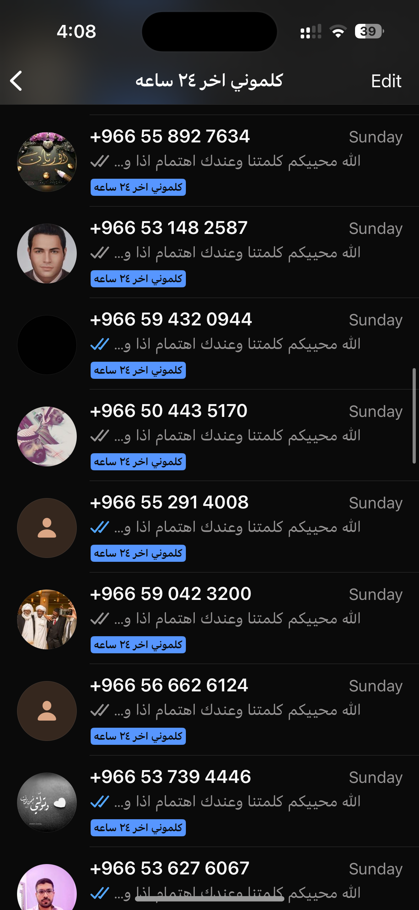

# WhatsApp OCR & Data Parser 📝📊

A **Python-based OCR and data parsing tool** that automatically extracts data from WhatsApp screenshots and organizes it into **Excel (.xlsx)** format.  
Perfect for quickly digitizing chat logs with **phone numbers, names, timestamps, and messages**.

---

## 🚀 Features

- Extract **phone numbers**, **names**, **timestamps**, and **messages** from WhatsApp screenshots.  
- Supports **bulk processing** of multiple images.  
- Outputs results into **Excel (.xlsx)** with multiple sheets:
  - `Phone Numbers` – all detected numbers with context  
  - `Unique Numbers` – deduplicated numbers  
  - `Summary` – overview per image  
  - `All Text` – full OCR-extracted text  
- **Supports Arabic, English, and other languages**.  
- Configurable via **`setting.py`**, with default values if file is missing.  

---

## 💡 Example

### Source Image



### Excel Result (`result.xlsx`)

| Image_Name | Phone_Number   | Name                 | Timestamp   |
|------------|----------------|--------------------|------------|
| 1.png      | +966504435170  | كلموني اخر ٢٤ ساعه | Sunday 4:08 |
| 1.png      | +966590423200  | كلموني اخر ٢٤ ساعه | Sunday 4:08 |
| 1.png      | +966566626124  | كلموني اخر ٢٤ ساعه | Sunday 4:08 |
| 1.png      | +966537394446  | كلموني اخر ٢٤ ساعه | Sunday 4:08 |
| 1.png      | +966594320944  | كلموني اخر ٢٤ ساعه | Sunday 4:08 |
| 1.png      | +966531482587  | كلموني اخر ٢٤ ساعه | Sunday 4:08 |
| 1.png      | +966536276067  | كلموني اخر ٢٤ ساعه | Sunday 4:08 |
| 1.png      | +966558927634  | كلموني اخر ٢٤ ساعه | Sunday 4:08 |
| 1.png      | +966552914008  | كلموني اخر ٢٤ ساعه | Sunday 4:08 |

---

## ⚡ How to Use

1. Install dependencies:

    ```bash
    pip install -r requirements.txt
    ```

2. Place your WhatsApp screenshots in the `source_image/` folder.  

3. (Optional) Customize the settings in `setting.py` if needed:
   ```python
   # Default settings will be used if setting.py does not exist
   SOURCE_DIR = 'source_image'    # Folder containing your images
   OUTPUT_EXCEL = 'result.xlsx'   # Excel file to save results
   LANGUAGES = ['en', 'ar']       # Languages to use for OCR
   USE_GPU = False                 # Set True to use GPU if available

4. Run the script:
    ```bash
    python app.py
    ```

5.  After processing, the extracted data will be saved to `result.xlsx`, with multiple sheets:

    - **Phone Numbers** – all detected numbers with context
    - **Unique Numbers** – deduplicated numbers
    - **Summary** – overview per image
    - **All Text** – complete OCR text


## 📈 Why This Project Rocks

- Saves **hours of manual data entry**.
- Handles **Arabic, English, and other languages** seamlessly.
- Outputs structured Excel for **analytics, CRM, or reporting pipelines**.
- Fully **configurable via settings**; defaults ensure it works out-of-the-box.

## 🔧 Tech Stack

- Python 🐍
- EasyOCR 🔍 (OCR engine for text extraction)
- Pandas 🧮 (data processing & Excel export)
- OpenCV / PIL 🖼 (image handling)
- Excel (.xlsx) output with multiple sheets 📊